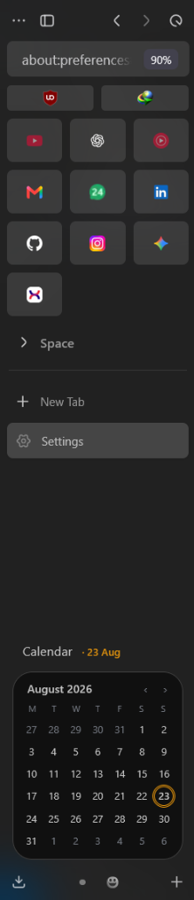
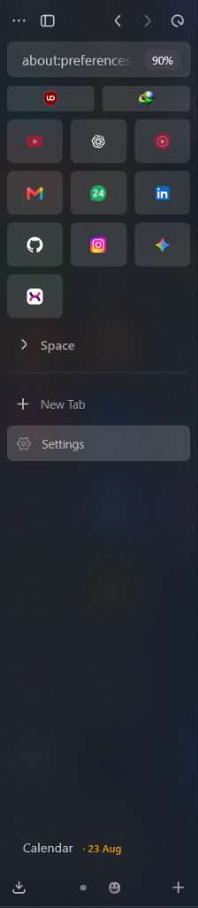
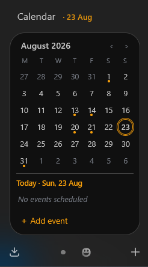

# Zen Calendar 📅

An elegant, interactive, and fully theme-aware sidebar calendar mod for [Zen Browser](https://zen-browser.app/). 

Designed specifically to integrate seamlessly with custom setups and themes like **Arc 2.0** and **Wireframe 2.0**, this calendar lives right in your sidebar, keeping your schedule perfectly organized without breaking your workflow.

  
  
   
  <em>The calendar integrates seamlessly with the Zen sidebar, perfectly adapting to both its expanded and collapsed states.</em>

## ✨ Features

- **Native Integration:** Sits neatly at the bottom of your workspace tabs, expanding and collapsing just like a native Zen sidebar element.
- **Theme-Aware Aesthetics:** Automatically inherits your current Zen or Sine themes (background colors, text colors, borders, border-radius, and hover states). No hardcoded colors!
- **Interactive Agenda & Event Dots:** Click any day to add, edit, or delete events. See at a glance which days have events with subtle, color-coded event dots on the calendar grid.
- **Dynamic Accent Colors:** Has different accent colors to choose from. This is shown below with the Agenda and Event dots enabled:
    
  
    
- **Live Settings (via Sine):** Tweak the calendar without restarting your browser! Changes to preferences instantly apply on the fly.
- **Compact Mode:** Need more space for your tabs? Toggle the compact mode for a denser, smaller calendar footprint.
- **Header Date Highlight:** A beautiful, accent-colored current date string (e.g. `· 23 Aug`) dynamically displays next to the Calendar title.

## ⚙️ Customization (Preferences)

Accessible directly via the **Sine Mod Manager** settings, Zen Calendar gives you complete control:

- **Enable Calendar:** Toggle the entire widget on or off.
- **Start Expanded:** Choose whether the calendar starts open or collapsed when launching Zen.
- **Show Agenda:** Show or hide the daily event agenda view.
- **Show Event Dots:** Toggle the small colored indicator dots on days with scheduled events.
- **Monday First:** Start the week on Monday instead of Sunday.
- **Compact Calendar:** Switch to a tighter UI layout for smaller screens.
- **Accent Color:** Choose from a curated list of highlight colors (Blue, Purple, Green, Orange, Red, White) for the current date, buttons, and event dots.

## 🚀 Installation

This mod is designed to be installed and managed via the **Sine Mod Manager**.

1. Open **Sine** in Zen Browser.
2. Clone or add this repository to your Sine mods directory.
3. Enable **Zen Calendar** in the Sine dashboard.
4. Click the gear icon `⚙️` to adjust your preferences and pick your favorite accent color.

## 🛠️ Built With
- Pure Vanilla JavaScript (`calendar.uc.js`)
- Custom CSS Variables (`userChrome.css`)
- Sine Mod API (`preferences.json` / `theme.json`)

---

*Enjoy a more productive browsing experience with Zen Calendar!* 🚀
